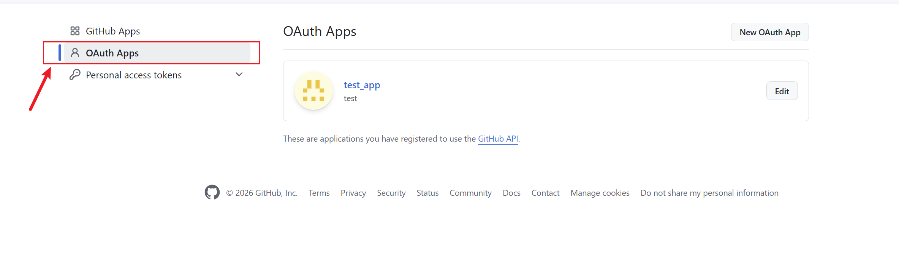
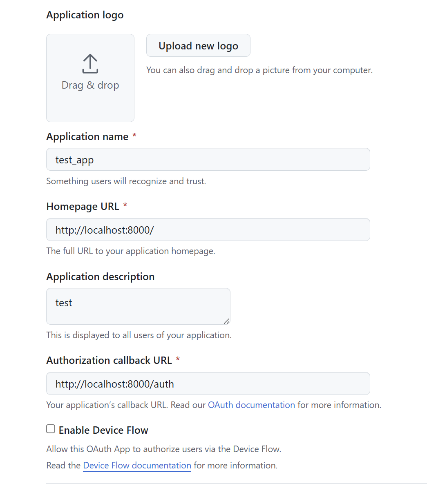

Auth 认证演进速览（FastAPI + SQLite）
====================================

本仓库包含 3 个独立的最小可运行示例，展示从 Session Cookie → JWT → SSO(OAuth2/OIDC 授权码) 的演进。

均使用 FastAPI、SQLite 单文件数据库，以及简单的 HTML/JS 表单。

快速开始
--------
```bash
uv sync
```

示例 1：Session Cookie（01_seasion_cookie）
------------------------------------------
- 启动：`uvicorn main:app --reload --port 8001 --app-dir 01_seasion_cookie`
- 默认用户：`alice / 123456`（启动时自动写入 SQLite）
- 访问 `http://localhost:8001/`，表单登录后服务器创建带签名的 `sid` Cookie，内存维护会话，退出即失效。
- 受保护接口：`GET /protected`（返回 JSON，需要登录）

示例 2：JWT（02_jwt）
--------------------
- 启动：`uvicorn main:app --reload --port 8002 --app-dir 02_jwt`
- 登录接口：`POST /api/login` 返回 `{access, refresh}`，并设置 `HttpOnly access_token` Cookie。
- 刷新接口：`POST /api/refresh`，表单字段名 `refresh_token`。
- 受保护接口：`GET /me`，从 `Authorization: Bearer <access>` 或 `access_token` Cookie 解码 JWT。
- 访问 `http://localhost:8002/` 使用自带 HTML 按钮演示调用。

示例 3：SSO / OAuth2 授权码（03_sso）
-----------------------------------
- 依赖环境变量：
  - `GITHUB_CLIENT_ID`
  - `GITHUB_CLIENT_SECRET`
- 启动：`uvicorn main:app --reload --port 8003 --app-dir 03_sso`
- 浏览 `http://localhost:8003/`，点击跳转 GitHub OAuth 登录，回调后显示 GitHub 账号信息。
- 如需自建 IdP（如 Keycloak），修改 `oauth.register` 中的 `authorize_url / access_token_url / api_base_url`。

文件结构
--------
- `01_seasion_cookie/main.py`：服务器状态会话；签名 cookie + 内存会话表。
- `02_jwt/main.py`：无状态 JWT；短效 access + refresh token。
- `03_sso/main.py`：基于 Authlib 的外部 IdP 登录示例。
- `pyproject.toml`：依赖列表。

学习要点对比
-----------
- Session：服务端可随时使会话失效；多实例需共享会话存储。
- JWT：前后端分离友好；无法单独废弃已签发 token，需短时效 + 刷新/黑名单策略。
- SSO/OIDC：统一身份入口；应用只信任 IdP 回调票据，适合多系统或第三方账号。

调试建议
--------
- 每个示例的 SQLite `auth.db` 与代码放在同一目录，启动时自动创建并写入 demo 用户。
- 生产环境请替换 `SECRET_KEY`/`SESSION_SECRET`，HTTPS 时为 Cookie 添加 `secure=True`。


# Github SSO 设置:


由于是本地运行跳转就填写 localhost:8000端口了

